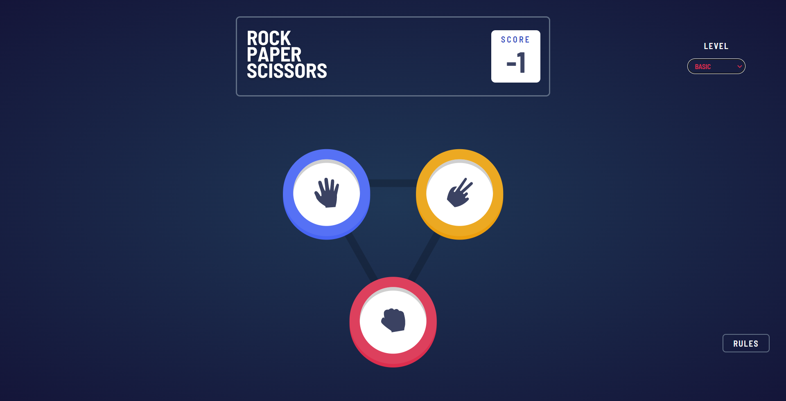
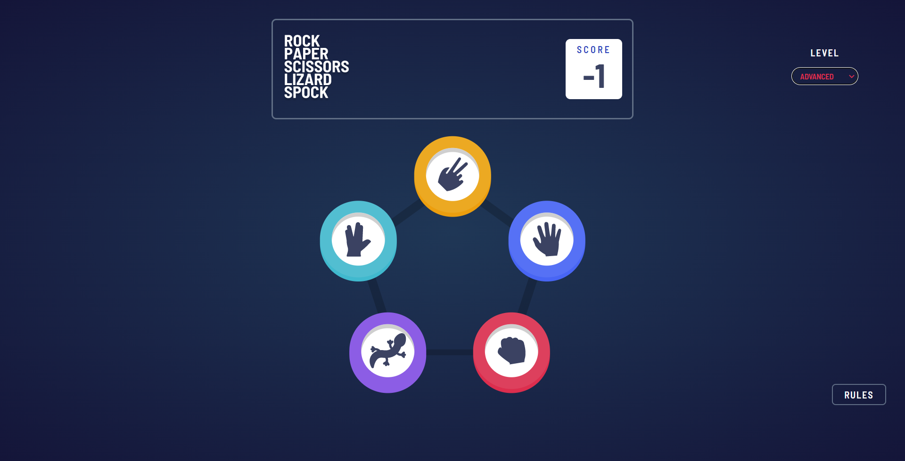
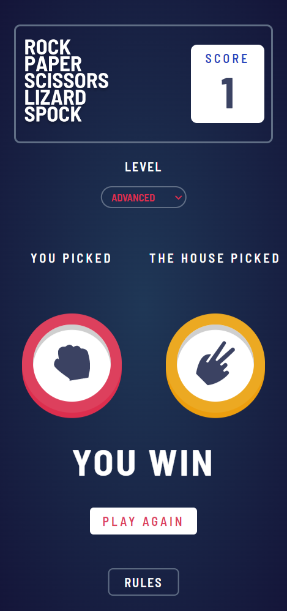
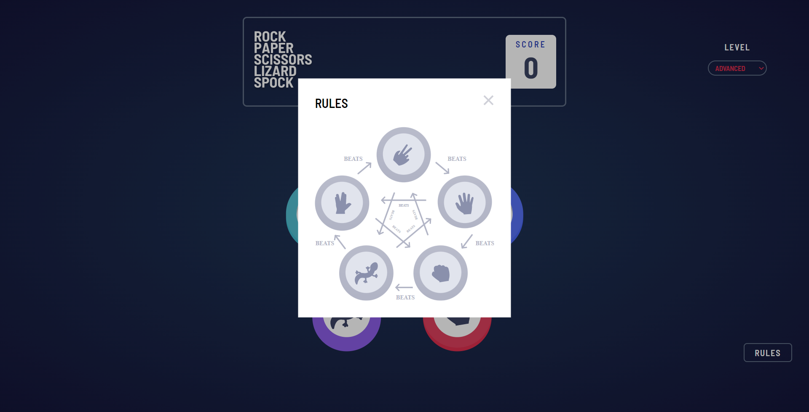

# Rock Paper Scissors Game

## Table of Contents
  - [Overview](#overview)  
  - [Screenshot](#screenshot)
  - [Built With](#built-with)
  - [Links](#links)
  - [Author](#author)
## Overview 
In this project I have made a rock-paper-scissors game, which the user can play against computer. The game has two levels basic and advanced. In Basic Mode you will be playing with rock, paper, and scissors like the traditional game. In the advanced version user will be playing with rock, paper, scissors, lizard, and spock. Rules of the game has also been mentioned to help the user. The Website design is also mobile responsive. Assets have been referenced from front end mentor. Play the game and if you like it make sure to star the repo.
## Screenshot

  

  

  

  

  

## Built With 
  - React App
  - Create React App
  - Netlify
  - Frontend Mentor coding challenge
  - Git  
## Links
  - Live Site - [Play](https://lambent-pudding-2e45d6.netlify.app/)  
  - Basic App - [link](https://github.com/SOURABH358/Rock-Paper-Scissor-Game)
  - Solution Url - [link](https://www.frontendmentor.io/solutions/rock-paper-and-scissors-game-y-goUAtnDd)
  - [Code](./)   

## Author
GitHub - [@Sourabh358](https://github.com/SOURABH358)  
Frontend Mentor - [@Sourabh358](https://www.frontendmentor.io/profile/sourabh358)  
❤ **Sourabh Yadav**
